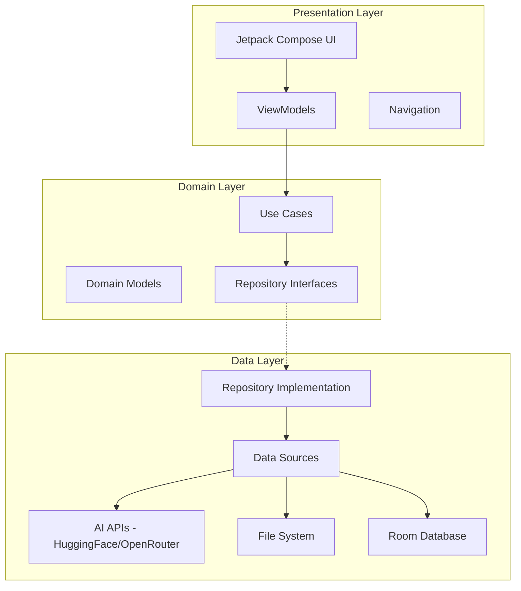
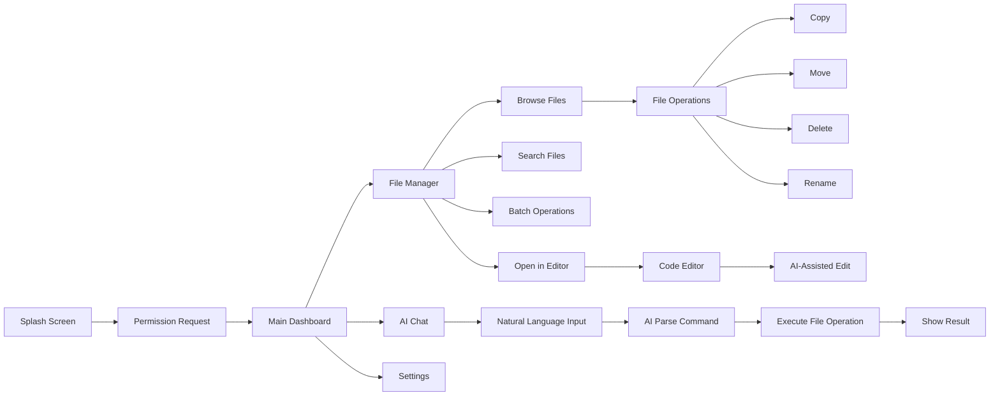

# AI File Manager - Android App Architecture Plan

## Project Overview

A modern Android application that combines file management capabilities with AI-powered features. The app allows users to manage files with natural language commands through AI integration (HuggingFace and OpenRouter).

---

## Tech Stack

### Core Technologies
| Category | Technology |
|----------|------------|
| Language | Kotlin 1.9+ |
| UI Framework | Jetpack Compose with Material Design 3 |
| Architecture | MVVM + Clean Architecture |
| Dependency Injection | Hilt |
| Async Operations | Kotlin Coroutines & Flow |
| Networking | Retrofit + OkHttp |
| Local Storage | Room Database |
| Preferences | DataStore |
| Serialization | Kotlinx Serialization |

### AI Integration
- **HuggingFace Inference API** - For local AI models
- **OpenRouter API** - For access to multiple LLM providers

---

## Architecture Diagram



---

## Module Structure

```
app/
├── build.gradle.kts
├── src/
│   ├── main/
│   │   ├── java/com/aifilemanager/
│   │   │   ├── AiFileManagerApp.kt
│   │   │   ├── MainActivity.kt
│   │   │   │
│   │   │   ├── core/                    # Core utilities
│   │   │   │   ├── permission/
│   │   │   │   │   ├── PermissionManager.kt
│   │   │   │   │   └── PermissionHandler.kt
│   │   │   │   ├── theme/
│   │   │   │   │   ├── Theme.kt
│   │   │   │   │   ├── Color.kt
│   │   │   │   │   └── Typography.kt
│   │   │   │   ├── navigation/
│   │   │   │   │   └── NavigationGraph.kt
│   │   │   │   └── util/
│   │   │   │       ├── FileUtils.kt
│   │   │   │       └── Constants.kt
│   │   │   │
│   │   │   ├── feature_filemanager/     # File Manager Feature
│   │   │   │   ├── domain/
│   │   │   │   │   ├── model/
│   │   │   │   │   │   ├── FileItem.kt
│   │   │   │   │   │   └── FileType.kt
│   │   │   │   │   ├── repository/
│   │   │   │   │   │   └── FileRepository.kt
│   │   │   │   │   └── usecase/
│   │   │   │   │       ├── BrowseFilesUseCase.kt
│   │   │   │   │       ├── CreateFileUseCase.kt
│   │   │   │   │       ├── DeleteFileUseCase.kt
│   │   │   │   │       ├── CopyFileUseCase.kt
│   │   │   │   │       ├── MoveFileUseCase.kt
│   │   │   │   │       ├── SearchFilesUseCase.kt
│   │   │   │   │       └── BatchOperationUseCase.kt
│   │   │   │   ├── data/
│   │   │   │   │   ├── repository/
│   │   │   │   │   │   └── FileRepositoryImpl.kt
│   │   │   │   │   └── datasource/
│   │   │   │   │       └── FileDataSource.kt
│   │   │   │   └── presentation/
│   │   │   │       ├── FileManagerScreen.kt
│   │   │   │       ├── FileManagerViewModel.kt
│   │   │   │       └── components/
│   │   │   │           ├── FileListItem.kt
│   │   │   │           ├── FileGridItem.kt
│   │   │   │           ├── PathBreadcrumb.kt
│   │   │   │           └── FileOperationDialog.kt
│   │   │   │
│   │   │   ├── feature_editor/          # Code Editor Feature
│   │   │   │   ├── domain/
│   │   │   │   │   ├── model/
│   │   │   │   │   │   └── CodeFile.kt
│   │   │   │   │   ├── repository/
│   │   │   │   │   │   └── EditorRepository.kt
│   │   │   │   │   └── usecase/
│   │   │   │   │       ├── ReadFileUseCase.kt
│   │   │   │   │       ├── WriteFileUseCase.kt
│   │   │   │   │       ├── EditLineUseCase.kt
│   │   │   │   │       └── GetSyntaxHighlightingUseCase.kt
│   │   │   │   ├── data/
│   │   │   │   │   └── repository/
│   │   │   │   │       └── EditorRepositoryImpl.kt
│   │   │   │   └── presentation/
│   │   │   │       ├── CodeEditorScreen.kt
│   │   │   │       ├── CodeEditorViewModel.kt
│   │   │   │       └── components/
│   │   │   │           ├── CodeTextField.kt
│   │   │   │           ├── LineNumbers.kt
│   │   │   │           └── SyntaxHighlighter.kt
│   │   │   │
│   │   │   ├── feature_aichat/          # AI Chat Feature
│   │   │   │   ├── domain/
│   │   │   │   │   ├── model/
│   │   │   │   │   │   ├── ChatMessage.kt
│   │   │   │   │   │   ├── AIProvider.kt
│   │   │   │   │   │   └── AIRequest.kt
│   │   │   │   │   ├── repository/
│   │   │   │   │   │   └── AIRepository.kt
│   │   │   │   │   └── usecase/
│   │   │   │   │       ├── SendAIRequestUseCase.kt
│   │   │   │   │       ├── ExecuteAICommandUseCase.kt
│   │   │   │   │       └── ParseFileCommandUseCase.kt
│   │   │   │   ├── data/
│   │   │   │   │   ├── repository/
│   │   │   │   │   │   └── AIRepositoryImpl.kt
│   │   │   │   │   ├── remote/
│   │   │   │   │   │   ├── HuggingFaceApi.kt
│   │   │   │   │   │   ├── OpenRouterApi.kt
│   │   │   │   │   │   └── dto/
│   │   │   │   │   │       ├── HuggingFaceRequest.kt
│   │   │   │   │   │       ├── HuggingFaceResponse.kt
│   │   │   │   │   │       ├── OpenRouterRequest.kt
│   │   │   │   │   │       └── OpenRouterResponse.kt
│   │   │   │   │   └── local/
│   │   │   │   │       ├── ChatHistoryDao.kt
│   │   │   │   │       └── ChatHistoryEntity.kt
│   │   │   │   └── presentation/
│   │   │   │       ├── AIChatScreen.kt
│   │   │   │       ├── AIChatViewModel.kt
│   │   │   │       └── components/
│   │   │   │           ├── ChatBubble.kt
│   │   │   │           ├── MessageInput.kt
│   │   │   │           └── ProviderSelector.kt
│   │   │   │
│   │   │   ├── feature_settings/        # Settings Feature
│   │   │   │   ├── domain/
│   │   │   │   │   └── model/
│   │   │   │   │       └── AppSettings.kt
│   │   │   │   ├── data/
│   │   │   │   │   └── SettingsDataStore.kt
│   │   │   │   └── presentation/
│   │   │   │       ├── SettingsScreen.kt
│   │   │   │       └── SettingsViewModel.kt
│   │   │   │
│   │   │   └── di/                      # Dependency Injection
│   │   │       ├── AppModule.kt
│   │   │       ├── NetworkModule.kt
│   │   │       ├── DatabaseModule.kt
│   │   │       └── RepositoryModule.kt
│   │   │
│   │   ├── res/
│   │   │   └── drawable/
│   │   └── AndroidManifest.xml
│   └── test/
└── build.gradle.kts
```

---

## Data Models

### FileItem
```kotlin
data class FileItem(
    val id: String,
    val name: String,
    val path: String,
    val isDirectory: Boolean,
    val size: Long,
    val lastModified: Long,
    val mimeType: String?,
    val extension: String?
)
```

### ChatMessage
```kotlin
data class ChatMessage(
    val id: String,
    val content: String,
    val isFromUser: Boolean,
    val timestamp: Long,
    val attachedFiles: List<String> = emptyList()
)
```

### AIProvider
```kotlin
sealed class AIProvider {
    data class HuggingFace(val model: String, val apiKey: String) : AIProvider()
    data class OpenRouter(val model: String, val apiKey: String) : AIProvider()
}
```

---

## UI/UX Design Flow



---

## Screen Designs

### 1. Main Dashboard
- Quick access cards for recent files
- Storage usage indicator
- Quick actions: New File, Search, AI Chat
- Bottom navigation: Files, AI Chat, Settings

### 2. File Manager Screen
- Path breadcrumb navigation
- List/Grid view toggle
- Sort and filter options
- Multi-select mode for batch operations
- FAB for create new file/folder
- Swipe actions for quick operations

### 3. Code Editor Screen
- Line numbers
- Syntax highlighting for common languages
- Line-based editing with cursor positioning
- AI assistance button for code suggestions
- Save/Save As options
- Undo/Redo functionality

### 4. AI Chat Screen
- Chat interface with message bubbles
- File attachment support
- AI provider selector dropdown
- Command suggestions
- Operation history

### 5. Settings Screen
- AI Provider configuration
- API key management
- Theme selection: Light/Dark/System
- Default file view preference
- Storage location settings

---

## API Integration

### HuggingFace Inference API
```kotlin
interface HuggingFaceApi {
    @POST("models/{model}")
    suspend fun inference(
        @Path("model") model: String,
        @Header("Authorization") auth: String,
        @Body request: HuggingFaceRequest
    ): HuggingFaceResponse
}
```

### OpenRouter API
```kotlin
interface OpenRouterApi {
    @POST("chat/completions")
    suspend fun chatCompletion(
        @Header("Authorization") auth: String,
        @Body request: OpenRouterRequest
    ): OpenRouterResponse
}
```

---

## Permission Handling

```kotlin
enum class StoragePermissionState {
    GRANTED,
    DENIED,
    MANAGE_APP_FILES,  // Android 11+
    LEGACY_STORAGE     // Android 10 and below
}

class PermissionManager(private val context: Context) {
    fun checkStoragePermission(): StoragePermissionState
    fun requestStoragePermission(activity: Activity)
    fun openAppSettings()
}
```

---

## AI Command Parsing

The AI will understand natural language commands like:

| User Command | Parsed Action |
|-------------|---------------|
| Delete all PDF files in Downloads | Batch delete *.pdf in /Downloads |
| Create a new file called notes.txt in Documents | Create file at /Documents/notes.txt |
| Edit line 5 in config.json and change port to 8080 | Open file, edit specific line |
| Move all images to Pictures folder | Batch move image files |
| Find all files larger than 100MB | Search with size filter |
| Read the content of readme.md | Display file content |

---

## Implementation Phases

### Phase 1: Foundation
- [ ] Project setup with Gradle Kotlin DSL
- [ ] Implement core theme and design system
- [ ] Setup Hilt dependency injection
- [ ] Implement permission handling
- [ ] Create navigation structure

### Phase 2: File Manager Core
- [ ] Implement file browsing functionality
- [ ] Create file list/grid UI components
- [ ] Implement basic file operations: create, delete, copy, move
- [ ] Add file search functionality
- [ ] Implement batch operations

### Phase 3: Code Editor
- [ ] Create code editor UI with line numbers
- [ ] Implement syntax highlighting
- [ ] Add file read/write operations
- [ ] Implement line-specific editing
- [ ] Add undo/redo functionality

### Phase 4: AI Integration
- [ ] Implement HuggingFace API client
- [ ] Implement OpenRouter API client
- [ ] Create AI chat interface
- [ ] Implement command parsing logic
- [ ] Connect AI commands to file operations

### Phase 5: Polish & Features
- [ ] Add settings screen
- [ ] Implement theme switching
- [ ] Add chat history persistence
- [ ] Performance optimization
- [ ] Error handling and edge cases

---

## Dependencies

```kotlin
// Core
implementation("androidx.core:core-ktx:1.12.0")
implementation("androidx.lifecycle:lifecycle-runtime-ktx:2.7.0")
implementation("androidx.activity:activity-compose:1.8.2")

// Compose
implementation(platform("androidx.compose:compose-bom:2024.01.00"))
implementation("androidx.compose.ui:ui")
implementation("androidx.compose.material3:material3")
implementation("androidx.compose.ui:ui-tooling-preview")

// Navigation
implementation("androidx.navigation:navigation-compose:2.7.6")

// Hilt
implementation("com.google.dagger:hilt-android:2.50")
kapt("com.google.dagger:hilt-compiler:2.50")
implementation("androidx.hilt:hilt-navigation-compose:1.1.0")

// Networking
implementation("com.squareup.retrofit2:retrofit:2.9.0")
implementation("com.squareup.okhttp3:logging-interceptor:4.12.0")
implementation("org.jetbrains.kotlinx:kotlinx-serialization-json:1.6.2")

// Database
implementation("androidx.room:room-runtime:2.6.1")
implementation("androidx.room:room-ktx:2.6.1")
kapt("androidx.room:room-compiler:2.6.1")

// DataStore
implementation("androidx.datastore:datastore-preferences:1.0.0")

// Coroutines
implementation("org.jetbrains.kotlinx:kotlinx-coroutines-android:1.7.3")
```

---

## Security Considerations

1. **API Key Storage**: Use Android Keystore for encrypting API keys
2. **File Access**: Scoped storage compliance for Android 11+
3. **Network Security**: Certificate pinning for API calls
4. **User Data**: No telemetry, all data stays on device

---

## Testing Strategy

- **Unit Tests**: Use cases, repositories, view models
- **Integration Tests**: API clients, database operations
- **UI Tests**: Compose testing for critical user flows

---

## Next Steps

1. Review and approve this architecture plan
2. Switch to Code mode to begin implementation
3. Start with Phase 1: Foundation setup
